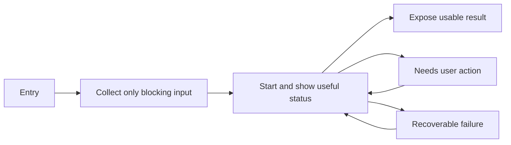
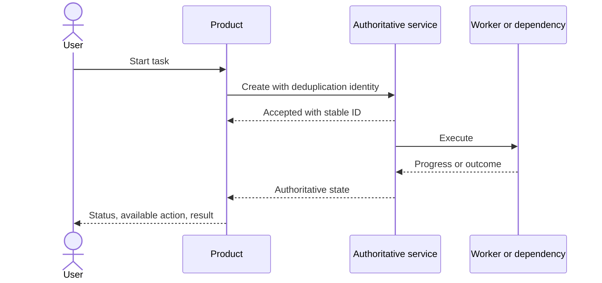

# Optional clarification artifacts

Use an artifact only when prose is harder to implement or verify. Do not emit one merely because the skill can. A compact artifact is usually better than several overlapping ones.

## Choose by ambiguity

- **Flow sketch:** branches or entry/re-entry paths are hard to follow.
- **State/transition table:** feedback, actions, ownership, or recovery varies by state.
- **Sequence diagram:** asynchronous ownership or cross-system ordering is the main risk.
- **Information table:** the core problem is what to ask, infer, default, or defer.
- **Data-flow table:** payload ownership, validation, retention, or boundary failure matters.
- **Component/ownership map:** responsibilities or sources of truth cross multiple modules/services.
- **Decision record:** alternatives have consequential trade-offs worth preserving.
- **Rollout table:** mixed versions, migration order, flags, or rollback conditions are the main risk.

If a short Flow Contract communicates the same decision, use that instead.

## Flow sketch



Replace generic nodes with domain behavior and remove impossible branches.

## State/transition table

| State | Owner | User understands/can do | Exit | Next state | Refresh/recovery |
|---|---|---|---|---|---|
|  |  |  |  |  |  |

Include only states with a distinct product consequence.

## Information table

| Input | Why needed | Known/infer/default/ask now/later | Source | Correction/validation |
|---|---|---|---|---|
|  |  |  |  |  |

## Data-flow table

| Payload | From -> to | Trigger/purpose | Validation/source of truth | Persistence/retention | Failure/compensation | User-visible effect |
|---|---|---|---|---|---|---|
|  |  |  |  |  |  |  |

## Sequence diagram



## Component and ownership map

| Component/service | Responsibility | Owned data/state | Inbound contracts | Outbound contracts | Failure boundary |
|---|---|---|---|---|---|
|  |  |  |  |  |  |

Use this when a coding Agent could otherwise put a source of truth or responsibility in the wrong layer.

## Decision record

```text
Decision: <what is being decided>
Context/constraints: <why this decision matters now>
Chosen approach: <concise design>
Consequences: <benefits, costs, risks, reversibility>
Alternatives rejected: <only meaningful alternatives and why>
Validation/open question: <evidence still needed>
```

## Rollout and migration table

| Phase | Product behavior | Code/data compatibility | Exposure/flag | Success signal | Rollback trigger/action | Cleanup gate |
|---|---|---|---|---|---|---|
|  |  |  |  |  |  |  |

## Hygiene

- Match state and event names used by the spec and code.
- Label unresolved decisions instead of hiding assumptions.
- Remove blank template rows from delivered work.
- Keep the artifact reviewable in one pass; split only when responsibilities genuinely differ.
